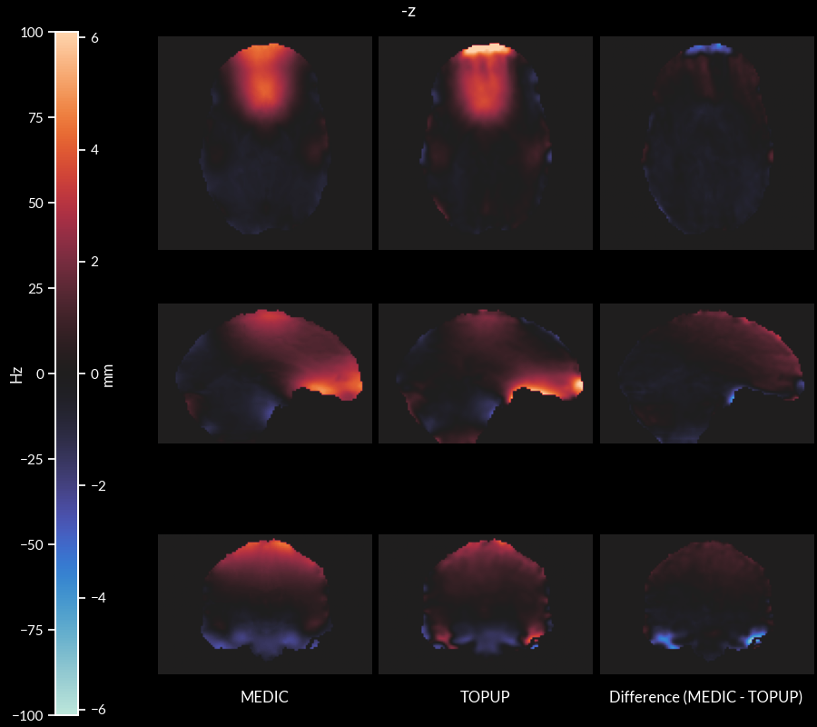
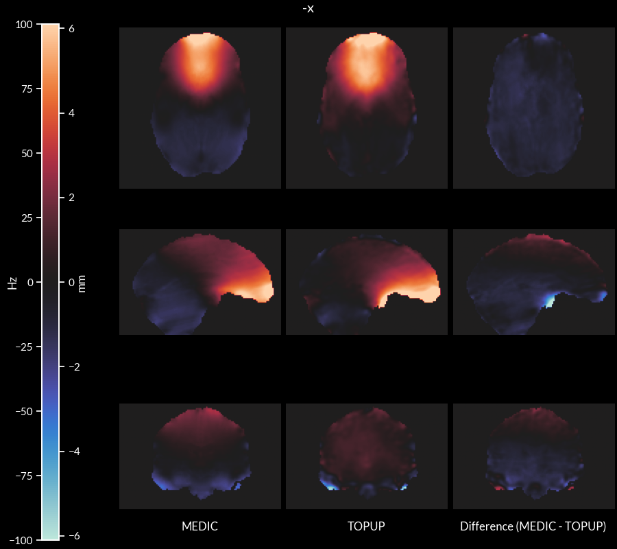
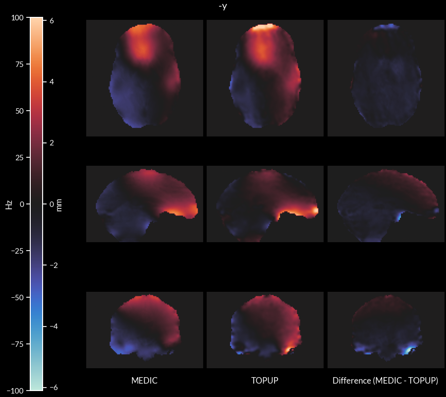
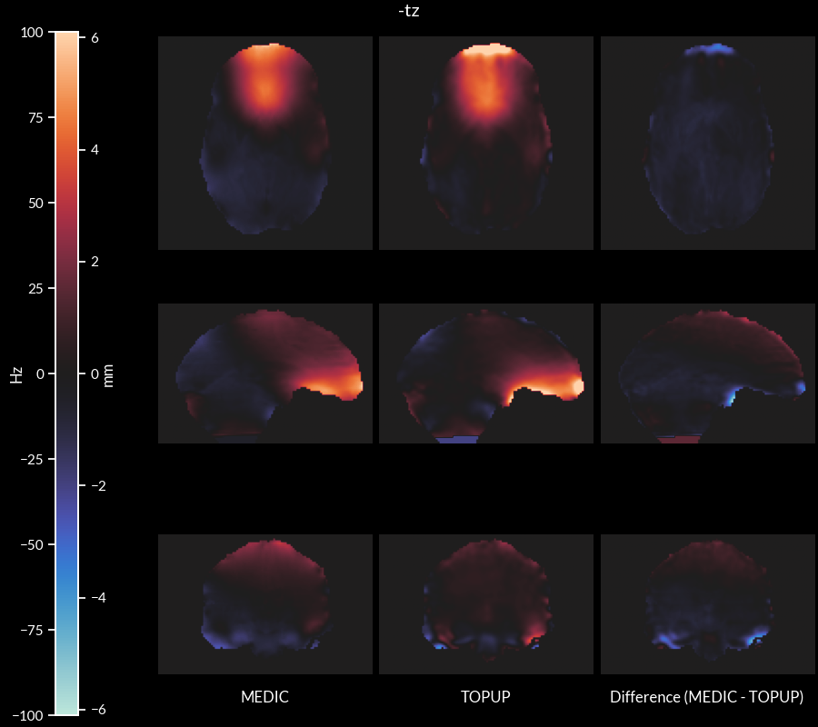

# Background

Traditional Field mapping uses a separate field map acquisition to obtain the field map.

```mermaid
graph LR
    start["Start"] --> pe1+
    subgraph rpe["Reverse Phase Encode Field Map (TOPUP)"]
        subgraph fmap1["Field Map"]
            pe1+["Phase Encode +"] --> pe1-["Phase Encode -"]
        end
        subgraph bold["BOLD"]
            pe1- --> frame1
            frame1["Frame 1"] --> frame2
            frame2["Frame 2"] --> frame3
            frame3["Frame 3"] --> |.../...| frameN["Frame N"]
        end
        subgraph fmap2["Field Map"]
            frameN --> pe2+
            pe2+["Phase Encode +"] --> pe2-["Phase Encode -"]
        end
    end
    pe2- --> stop["End"]
```

In MEDIC, we use the phase information of a Multi-Echo EPI sequence to obtain a field map
for each frame.

```mermaid
flowchart LR
    start["Start"] --> frame1
    subgraph medic["Multi-Echo Distortion Correction (MEDIC)"]
        subgraph bold["ME-BOLD"]
            subgraph frame1["Frame 1"]
                phase1["ME Phase"] --> fmap1["Field Map 1"]
            end
            subgraph frame2["Frame 2"]
                phase2["ME Phase"] --> fmap2["Field Map 2"]
            end
            subgraph frame3["Frame 3"]
                phase3["ME Phase"] --> fmap3["Field Map 3"]
            end
            subgraph frameN["Frame N"]
                phaseN["ME Phase"] --> fmapN["Field Map N"]
            end
            frame1 --> frame2
            frame2 --> frame3
            frame3 --> |.../...| frameN
        end
    end
    frameN --> stop["End"]
```

Below are some results of the MEDIC algorithm being applied to a controlled head motion dataset.

## Experimental Setup

The participant was asked to remain still in various head positions as follows:

- Head in neutral position
- Head rotation in +z
- Head rotation in -z
- Head rotation in +x
- Head rotation in -x
- Head rotation in +y
- Head rotation in -y
- Translation in -Z

The scanner shim settings were fixed during the neutral position run to eliminate the influence of shimming on the
field. All rotations + translation runs were performed with the same shim settings as the neutral
position run.

In a second set of runs, the participant was asked to remain in the neutral position, then perform a movement mid scan in the specified directions:

- Head rotation from neutral to +z
- Head rotation from neutral to -z
- Head rotation from neutral to +x
- Head rotation from neutral to -x
- Head rotation from neutral to +y
- Head rotation from neutral to -y
- Head translation from neutral to -z

> __NOTE__: In this second set of runs, the SE-EPI field maps were only collected prior to
> movement (before the ME-EPI BOLD data was collected).

For each run, a SE-EPI field map (3 AP/PA frames, TR: 8 s, TE: 66 ms, 72 Slices, FOV: 110x110,
Voxel Size: 2.0mm) and 100 frames of ME-EPI BOLD (TR: 1.761 s, TEs: 14.2, 38.93, 63.66, 88.39, 113.12 ms, 72 Slices,
FOV: 110x110, Voxel Size: 2.0 mm, Multi-Band: 6) were acquired.

All ME-EPI BOLD data was rigid-body aligned with FLIRT to a single reference frame (neutral position) for comparison.
SE-EPI data were also rigid-body aligned to the first SE-EPI run (neutral position).

Field maps on ME-EPI BOLD data were computed with MEDIC, while field maps with SE-EPI data were computed with TOPUP.

# Results

> :warning: :warning: :warning: **For each video, right click and select "Loop" before
> playing.** :warning: :warning: :warning:

## Data quality/alignment checks

These figures were generated to check acquisition and alignment quality. I wanted to verify the following:

- That each ME-EPI BOLD run had a good quality alignment to the refrence frame.
- That each run of SE-EPI field map data had a good quality alignment to the first SE-EPI run.
- That there was minimal motion between the ME-EPI BOLD reference and the SE-EPI field map reference.

### ME-EPI BOLD data:

<video controls loop>
  <source src="test_outputs/alignment_check_bold.mp4" type="video/mp4">
</video>

https://user-images.githubusercontent.com/3641187/208332969-2dfdc78d-cf22-4ebf-86e2-2cea852d33e6.mp4

- ME-EPI BOLD data seemed to have good quality alignment to the reference frame.

### SE-EPI field map data:

<video controls loop>
  <source src="test_outputs/alignment_check_topup.mp4" type="video/mp4">
</video>

https://user-images.githubusercontent.com/3641187/208333190-2194ca71-0bf2-42c9-86d6-39391af2826e.mp4

- SE-EPI field map data seemed to have good quality alignment to the reference field map.

### Alignment between SE-EPI field map and ME-EPI BOLD data (1st run: neutral position):

<video controls loop>
  <source src="test_outputs/alignment_check_ref.mp4" type="video/mp4">
</video>

https://user-images.githubusercontent.com/3641187/208333859-1a0c27d4-a9c3-4087-ac96-5cb7434ca15f.mp4

- There seems to be a slight distortion difference (red circle) between the SE-EPI image and the ME-EPI bold data) that
cannot be explained by motion (there was insignificant motion between SE-EPI and ME-EPI runs):

## Alignment parameters for 1st set of runs (avg/std)

| Task           | rx (deg)            | ry (deg)            | rz (deg)           | tx (mm)        | ty (mm)        | tz (mm)           |
| -----------    | ------------------- | ------------------- | ------------------ | -------------- | -------------- | ----------------- |
| Neutral        | -0.093 (0.041)      | -0.151 (0.079)      | -0.081 (0.088)     | -0.174 (0.131) | -0.064 (0.042) | 0.015 (0.074)     |
| Rotation +z    | -1.543 (0.101)      | -1.474 (0.050)      | **14.957 (0.075)** | -2.257 (0.233) | -0.691 (0.037) | -2.936 (0.307)    |
| Rotation -z    | 0.991 (0.067)       | -1.903 (0.081)      | **-9.778 (0.050)** | -3.842 (0.049) | -0.260 (0.035) | -1.518 (0.091)    |
| Rotation +x    | **10.642 (0.273)**  | -2.510 (0.151)      | 0.853 (0.073)      | -0.982 (0.104) | 4.925 (0.177)  | 3.781 (0.167)     |
| Rotation -x    | **-13.726 (0.244)** | -2.799 (0.069)      | -0.942 (0.164)     | -2.452 (0.251) | -4.215 (0.070) | 0.705 (0.138)     |
| Rotation +y    | -1.380 (0.052)      | **-10.789 (0.064)** | 21.442 (0.058)     | 2.718 (0.084)  | -2.154 (0.044) | -5.349 (0.145)    |
| Rotation -y    | 0.092 (0.094)       | **8.577 (0.215)**   | -18.853 (0.122)    | -5.786 (0.127) | -1.210 (0.044) | -3.313 (0.071)    |
| Translation -z | -3.088 (0.108)      | 0.127 (0.045)       | -1.529 (0.022)     | -1.473 (0.059) | 0.179 (0.067)  | **8.081 (0.066)** |

## Set 1 Results

### MEDIC field maps for each run (frames/avg/std)

#### Neutral Position

<video controls loop>
  <source src="test_outputs/medic_run-00.mp4" type="video/mp4">
</video>

#### Rotation +z

<video controls loop>
  <source src="test_outputs/medic_run-01.mp4" type="video/mp4">
</video>

#### Rotation -z

<video controls loop>
  <source src="test_outputs/medic_run-02.mp4" type="video/mp4">
</video>

#### Rotation +x

<video controls loop>
  <source src="test_outputs/medic_run-03.mp4" type="video/mp4">
</video>

#### Rotation -x

<video controls loop>
  <source src="test_outputs/medic_run-04.mp4" type="video/mp4">
</video>

#### Rotation +y

<video controls loop>
  <source src="test_outputs/medic_run-05.mp4" type="video/mp4">
</video>

#### Rotation -y

<video controls loop>
  <source src="test_outputs/medic_run-06.mp4" type="video/mp4">
</video>

#### Translation -z

<video controls loop>
  <source src="test_outputs/medic_run-14.mp4" type="video/mp4">
</video>

### MEDIC avg field map vs. topup field map

#### Neutral Position

#### Rotation +z

#### Rotation -z

#### Rotation +x

#### Rotation -x

#### Rotation +y

#### Rotation -y

#### Translation -z

### Uncorrected vs. MEDIC (avg) correction vs. TOPUP correction vs. T2w

This is just for run 1, I messed up the code for the other runs..., but will fix when I'm back from the holidays.

####  Uncorrected

<video controls loop>
  <source src="test_outputs/correction_compare_run-00_uncor.mp4" type="video/mp4">
</video>

#### MEDIC (avg) correction

<video controls loop>
  <source src="test_outputs/correction_compare_run-00_medic.mp4" type="video/mp4">
</video>

#### TOPUP correction

<video controls loop>
  <source src="test_outputs/correction_compare_run-00_topup.mp4" type="video/mp4">
</video>

### Uncorrected vs. MEDIC (avg) correction vs. TOPUP correction

<video controls loop>
  <source src="test_outputs/correction_compare_run-00_three.mp4" type="video/mp4">
</video>

## Set 2 Results

### MEDIC field maps vs. TOPUP field maps

#### Neutral to Rotation +z

<video controls loop>
  <source src="test_outputs/medic_run-07.mp4" type="video/mp4">
</video>

#### Neutral to Rotation -z

<video controls loop>
  <source src="test_outputs/medic_run-08.mp4" type="video/mp4">
</video>

#### Neutral to Rotation +x

<video controls loop>
  <source src="test_outputs/medic_run-09.mp4" type="video/mp4">
</video>

#### Neutral to Rotation -x

<video controls loop>
  <source src="test_outputs/medic_run-10.mp4" type="video/mp4">
</video>

#### Neutral to Rotation +y

<video controls loop>
  <source src="test_outputs/medic_run-11.mp4" type="video/mp4">
</video>

#### Neutral to Rotation -y

<video controls loop>
  <source src="test_outputs/medic_run-12.mp4" type="video/mp4">
</video>

#### Neutral to Translation -z

<video controls loop>
  <source src="test_outputs/medic_run-13.mp4" type="video/mp4">
</video>

# Summary

- MEDIC algorithm produces consistent field map solutions in varying head positions.
  - How to apply MEDIC to real data?
    - As an averaged field map over set of low motion frames? May be ideal since motion mitigation strategies in
    acquisition and processing already seem to be pretty good.
    - As a field map for each frame? Can handle motion better, but may be more prone to noise.
  - Currently, have version of Tim's ME NORDIC pipeline with both
  methods implemented. Will test on real data and see which one works better.
- TOPUP solutions are similar, but still quite different than MEDIC solutions (after controlling for shimming and
motion effects). Possible Reasons?
  - SE-EPI field maps seem to have slightly different distortions than ME-EPI BOLD data (what could cause this?)
  - Invertibility of TOPUP solution vs. MEDIC solution

